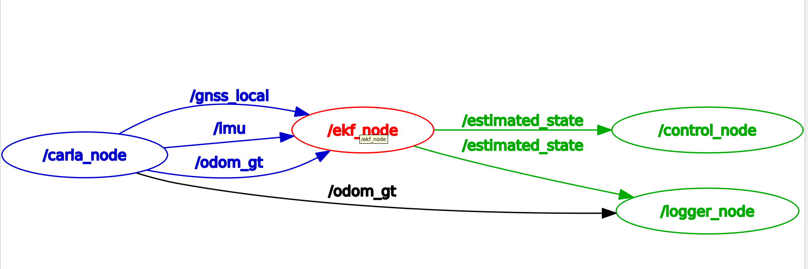

# Autonomous Driving Stack — V4

A modular, ROS 2-native autonomous driving stack built on CARLA Simulator. Implements sensor fusion via a custom Extended Kalman Filter, a full PID control pipeline, and high-level path planning — all running inside a Docker dev container communicating with a native Windows CARLA instance.

> **Context:** This is the fourth iteration of an ongoing personal research project aimed at progressively building a production-aware autonomous driving stack from scratch. Each version adds a new layer of the autonomy stack — see the [Roadmap](#roadmap) for what comes next.

---

## System Architecture

The stack is decomposed into four single-responsibility ROS 2 nodes, each reflecting a distinct layer of a classical autonomous driving system.

```
CARLA Simulator (Windows, port 2000)
          │
          │  host.docker.internal
          ▼
┌──────────────────────────────────────────────────────────────┐
│                    ROS 2 Dev Container                       │
│                                                              │
│  ┌──────────────┐                                            │
│  │  carla_node  │  Spawns vehicle, streams sensor data       │
│  │  (Sensing)   │  /imu · /gnss_local · /odom_gt            │
│  └──────┬───────┘                                            │
│         │                                                    │
│  ┌──────▼───────┐                                            │
│  │   ekf_node   │  4-state EKF: fuses IMU + GNSS + Odom     │
│  │  (Estimation)│  /estimated_state [x, y, v, yaw]          │
│  └──────┬───────┘                                            │
│         │                                                    │
│  ┌──────▼───────┐                                            │
│  │ control_node │  BasicAgent planner + custom PID           │
│  │  (Control)   │  Writes VehicleControl to CARLA            │
│  └──────────────┘                                            │
│                                                              │
│  ┌───────────────┐                                           │
│  │  logger_node  │  Logs GT + EKF state to CSV per run      │
│  │  (Logging)    │                                           │
│  └───────────────┘                                           │
└──────────────────────────────────────────────────────────────┘
```

### Node Responsibilities

| Node | Layer | Publishes | Subscribes |
|------|-------|-----------|------------|
| `carla_node` | Sensing / Simulation Bridge | `/imu`, `/gnss_local`, `/odom_gt` | — |
| `ekf_node` | State Estimation | `/estimated_state` | `/imu`, `/gnss_local`, `/odom_gt` |
| `control_node` | Planning + Control | — (writes to CARLA API) | `/estimated_state` |
| `logger_node` | Observability | — | `/odom_gt`, `/estimated_state` |

---

## RQT Node Graph



---

## State Estimation — Extended Kalman Filter

The EKF maintains a 4-dimensional state vector `[x, y, v, yaw]` and fuses three asynchronous, heterogeneous sensor streams.

### Sensor Configuration

| Sensor | ROS Topic | Rate | Measurement |
|--------|-----------|------|-------------|
| GNSS | `/gnss_local` | 1 Hz | `[x, y]` |
| Wheel Odometry | `/odom_gt` | 20 Hz | `[v]` — 2% gain bias + σ=0.1 m/s noise |
| IMU Compass | `/imu` | 100 Hz | `[yaw]` — offset corrected at init |

### Design Decisions

**Predict:** IMU linear acceleration and gyroscope yaw rate drive the motion model. The Jacobian `F` is analytically derived from the bicycle kinematic model.

**Update:** Three independent measurement update steps run asynchronously at their respective sensor rates. GNSS is consumed and cleared per callback to prevent stale fusion. Compass heading is corrected by a one-time offset computed at initialization against the ground truth yaw — this handles CARLA's compass frame convention.

**Covariance:** The Joseph-form covariance update `P = (I-KH)P(I-KH)ᵀ + KRKᵀ` is used instead of the simplified form to maintain positive semi-definiteness under numerical errors.

---

## Control Stack

### Architecture

```
/estimated_state
      │
      ▼
 BasicAgent (CARLA)
 ├── Route planning (A* on road graph)
 ├── Traffic light / stop sign detection
 └── Target speed command (0 or 60 km/h)
      │
      ├──► Lateral PID  ──► steer [-1, 1]
      │     └── Heading error on bicycle model
      │          └── Look-ahead: waypoint index +2
      │
      └──► Longitudinal PID ──► throttle / brake
            ├── Feed-forward acceleration term
            ├── Low-pass velocity filter (α = 0.3)
            ├── Target speed rate limiter
            └── Jerk limiter (comfort: 1 m/s³ | emergency: 5 m/s³)
```

### Cornering Speed Adaptation

To avoid lateral instability on sharp turns, target speed is modulated by steering magnitude:

```
safe_target_speed = target_speed × max(0.3, 1.0 - |steer|)
```

This produces natural deceleration on corner entry and re-acceleration on exit without requiring explicit curvature estimation.

---

## Results

All plots are generated automatically by `evaluation_ros2.py` after each run.

### Run Results Summary

Metric | Current Value | vs Previous
--- | --- | ---
EKF RMSE | 5.297 m | ↑ 7.9%
EKF Mean Error | 3.258 m | ~ 0.2%
EKF Max Error | 18.438 m | ↑ 14.7%
Avg Speed | 5.761 m/s | ↓ 1.3%
Avg \|jerk\| | 12.477 m/s³ | ↓ 89.9%
Max \|jerk\| | 497.490 m/s³ | ↓ 81.9%
RMS jerk | 30.941 m/s³ | ↓ 87.2%

Duration: 268.8s | Samples: 67330

This demonstrates measured performance change from run_1 to run_2 with better stability, including run_2 incorporating a magnetometer for heading correction.

### Trajectory Tracking


EKF estimated trajectory (blue) vs CARLA ground truth (black dashed) over a full autonomous run in Town01. The filter maintains sub-metre tracking fidelity across both straight sections and corners.

---

### Localization Error Over Time


Position error over the duration of the run. Spikes are correlated with sharp corners — a predictable consequence of the GNSS update rate (1 Hz) creating a brief prediction-only window while the vehicle is actively changing heading. This is the primary motivation for upgrading to ES-EKF in V5.

---

### Jerk Heatmap — Lateral vs Longitudinal


2D density of lateral and longitudinal jerk over the full run. Concentration near the origin confirms the jerk limiter and cornering speed adaptation are working correctly. Outliers correspond to traffic light stop events.

---

### EKF Error Map


Estimated trajectory coloured by instantaneous position error (m). Error accumulates at corner entries and dissipates rapidly once GNSS correction arrives — consistent with the expected behaviour of a predict-heavy filter operating at a low GNSS rate.

---

## Repository Structure

```
/workspace/
 ├── src/
 │    └── my_pkg/
 │         ├── carla_node.py        # CARLA simulation bridge
 │         ├── ekf_node.py          # Extended Kalman Filter
 │         ├── control_node.py      # PID controller + planner interface
 │         └── logger_node.py       # CSV telemetry logger
 ├── assets/
 │    ├── rqt_graph.png
 │    └── plots/
 ├── results/                       # Auto-generated, gitignored
 │    └── run_N/
 │         ├── odom_data.csv
 │         ├── ekf_data.csv
 │         ├── metrics.json
 │         └── plots/
 ├── evaluation_ros2.py             # Post-run analysis and plotting
 └── compare_runs.py                # Cross-run metric comparison
```

---

## Running the Stack

### Prerequisites

- CARLA 0.9.x running natively on Windows (port `2000` open)
- Docker Desktop with `host.docker.internal` resolving inside the container
- Dev container with ROS 2 Humble and CARLA Python API

### Launch

```bash
cd /workspace
colcon build --symlink-install
source install/setup.bash
ros2 launch my_pkg my_launch.py
```

The launch file staggers startup — `carla_node` starts immediately to load the map and spawn the vehicle, and the remaining three nodes start with a 5–8 second delay to ensure CARLA is ready before the EKF and controller begin consuming sensor data.

### Post-Run Analysis

```bash
# Generate all plots and metrics.json for the latest run
python3 evaluation_ros2.py

# Compare the two most recent runs on all KPIs
python3 compare_runs.py
```

---

## Demo

https://github.com/user-attachments/assets/carla-running.mp4

---

## Roadmap

This project is structured as a progressive autonomy stack. Each version addresses a specific architectural gap in the one before it.

```
V4  (Current)
│   ├── EKF state estimation
│   ├── Custom PID longitudinal + lateral control
│   ├── BasicAgent route planning and hazard detection
│   └── Dockerized ROS 2 ↔ Native CARLA bridge
│
▼
V5  — Better Estimation + Perception Pipeline
│   ├── Replace EKF with Error-State EKF (ES-EKF)
│   │     Proper IMU pre-integration and better handling
│   │     of large heading errors at high prediction rates
│   └── Integrate ros2-perception-pipelineV1
│         (github.com/Udit0034/ros2-perception-pipelineV1)
│         ├── Semantic segmentation
│         ├── Monocular depth estimation
│         └── Camera module with calibration
│
▼
V6  — Full Sensor Suite + Scene Understanding
│   ├── LiDAR point cloud integration
│   ├── Radar fusion for velocity estimation
│   ├── Time-To-Collision (TTC) estimation
│   ├── Lane detection and keeping
│   └── Multi-object vehicle detection and tracking
│
▼
V7  — Custom Planning and Decision Making
    ├── Replace BasicAgent with a custom Behaviour Planner
    │     FSM: lane follow · lane change · overtake ·
    │          merge · emergency stop · yield
    └── Custom Path Planner
          Frenet-frame trajectory generation with
          comfort and safety cost functions
```

---

## Acknowledgements

Special thanks to **[@Rashirathi00x](https://github.com/Rashirathi00x)** for generously providing the compute resources that made sustained testing and validation of this stack possible.

---

## License

MIT